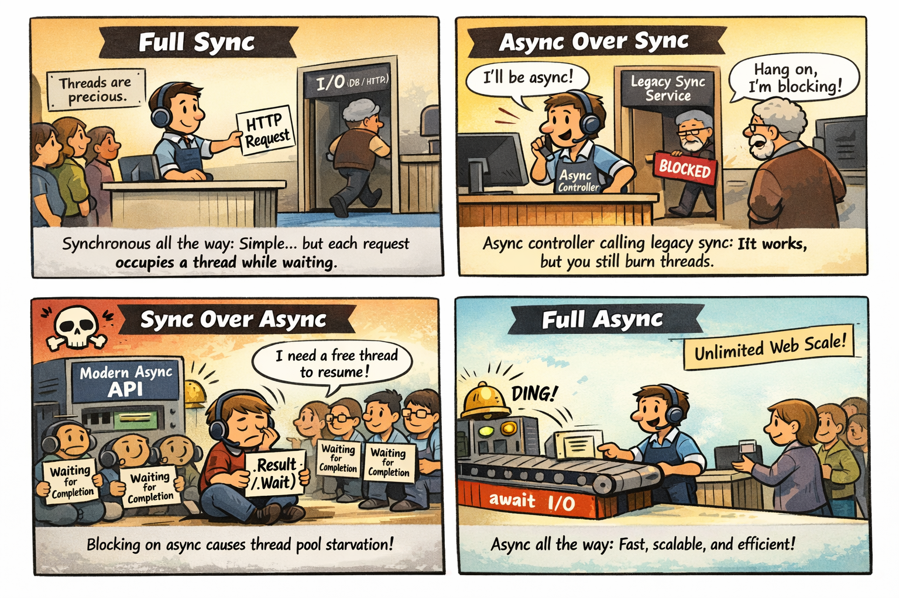

# Thread Starvation - async/await 

This repository was inspired by a great presentation from Damian Edwards and David Fowler 2018, really great! 
- [Youtube] https://www.youtube.com/watch?v=RYI0DHoIVaA  
- [Source code] https://github.com/davidfowl/NdcLondon2018  

A little bit outdated, but aged very well.  
For [Latest updates](#latest-updates-2026), scroll down to bottom.  

## Two Projects

- **[Threading](Threading/readme.md)** - A Hello World **Web API** with 4 endpoints demonstrating different async patterns:
  - Good old full synchronous execution: full-sync
  - Modern app with legacy services: async-over-sync, 
  - Old app code using modern APIs: sync-over-async - kills IIS ☠
  - Full async, shows unlimited web scale
- **[Requestor](Requestor/readme.md)** - Load testing tool that hammers the Threading endpoints. You can arrow up/down to scale parallel requests

## How to Use It

### Setup
1. Open the repository folder in VS Code
2. Open terminal (CTRL+`), split in two
3. Navigate to `~/Requestor` in the left terminal
4. Navigate to `~/Threading` in the right terminal

### Running the Demo
1. **Start the server** (right terminal): `dotnet run`
   - Displays available threads and handled requests in real-time
2. **Run load test** (left terminal): `dotnet run <method name>`
   - Use arrow ⬆/⬇ keys to increase/decrease parallel request load

### Available Test Endpoints

|Command | Pattern | Result|
|--------|---------|-------|
|`dotnet run full-sync` | Traditional synchronous execution | ✅ Works but limited scalability |
|`dotnet run async-over-sync` | Modern async controller calling legacy sync services | ⚠️ Suboptimal but functional |
|`dotnet run sync-over-async` | Legacy sync code calling modern async APIs | ☠️ **DANGER**: Thread pool starvation! |
|`dotnet run full-async` | Full async/await throughout the stack | 🚀 Unlimited scalability! |

> **⚠️ Warning**: The `sync-over-async` endpoint demonstrates thread pool starvation and can deadlock the server. You may need to forcefully kill the terminal to recover. Or cold reboot of a machine.

## Key Learnings

- **Never block on async code** - Using `.Wait()` or `.Result` on Tasks leads to thread pool starvation
- **Async all the way** - If you have async APIs, use them asynchronously throughout the entire call stack
- **Thread pool threads are precious** - Don't waste them waiting synchronously for I/O operations
- **Async-over-sync is acceptable** - When you must call legacy synchronous code from modern async APIs
- **Monitor your thread pool** - Use `ThreadPool.GetAvailableThreads()` to detect starvation issues early

This demo clearly shows the performance impact of different async patterns and why proper async/await usage is critical for scalable web applications.

## Latest updates (2026)

- Bump to dotnet 10.0
- Fix MaxThread setting for modern machines
- Also runs in GitHub Codespaces and Devcontainers (!!!)
- Generate diagram and comic strip with AI

### Diagrams
See [Threading Patterns Comparison](./threading-diagrams.md) for detailed flowcharts and a quick comparison  of each async/await pattern.  
All mermaid code is copilot generated, but I reviewed it manually, and looks perfect.  
These diagrams visually explain thread usage, scalability, and the risks of thread starvation.

#### One example #3: Sync-Over-Async Pattern ☠️

Legacy sync code calling modern async APIs - `Task.Delay().Wait()`

**Result**: ☠️ **DANGER** - Thread pool exhaustion! Original thread blocked waiting, continuation needs another thread to resume. With limited threads, all get blocked waiting for each other = deadlock.

---

## ChatGpt for cartoons, story telling, ...

I asked ChatGpt before to create the mermaid diagrams but was all crap, copilot could fix it.  
But I also asked ChatGpt to create a comic strip. All just based on one-shot prompt and readme and source code.  

