# Threading Patterns Comparison

Based on the ThreadStarvation demo showing different async/await patterns and their impact on thread pool utilization.

## 1. Full-Sync Pattern

Traditional synchronous code - `Thread.Sleep()`

**Result**: ⚠️ Works but limited scalability - thread is blocked entire time waiting for I/O

---

## 2. Async-Over-Sync Pattern

Modern async controller calling legacy sync code - `await Task.Run(() => Thread.Sleep())`

```mermaid
flowchart LR
    A[Request Arrives] --> B[Async Method]
    B --> C[Task.Run offloads<br/>to thread pool]
    C --> D[Thread.Sleep 2s<br/>🔴 Different thread blocked]
    D --> E[Return Response]
```

**Result**: ⚠️ Suboptimal but functional - uses extra thread pool thread, but doesn't cause deadlocks

---

## 3. Sync-Over-Async Pattern ☠️

Legacy sync code calling modern async APIs - `Task.Delay().Wait()`

**Result**: ☠️ **DANGER** - Thread pool exhaustion! Original thread blocked waiting, continuation needs another thread to resume. With limited threads, all get blocked waiting for each other = deadlock.

---

## 4. Full-Async Pattern

Modern async throughout - `await Task.Delay()`

**Result**: ✅ 🚀 Optimal - Thread released back to pool during I/O, unlimited scalability!

---

## Quick Comparison

| Pattern | Code | Thread Usage | Scalability |
|---------|------|--------------|-------------|
| **full-sync** | `Thread.Sleep()` | 1 thread blocked entire time | ⚠️ Limited |
| **async-over-sync** | `await Task.Run(() => Sleep())` | 2 threads (1 blocked) | ⚠️ Suboptimal |
| **sync-over-async** | `Task.Delay().Wait()` | Multiple threads blocked | ☠️ **DANGER** |
| **full-async** | `await Task.Delay()` | Thread released during I/O | ✅ Optimal |
